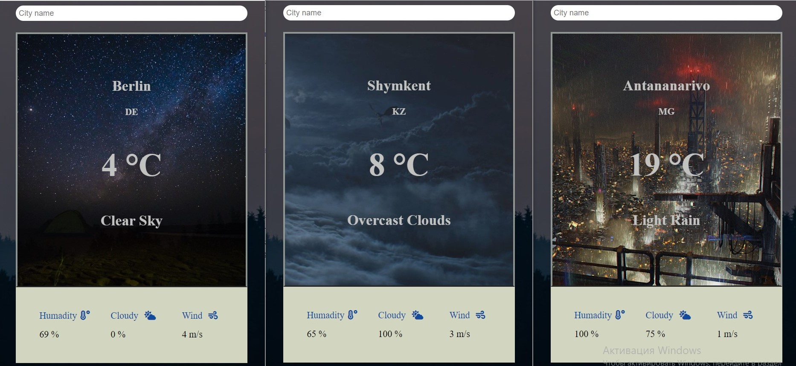

# Weather App

Weather App with function to detect current location.


### Installing and Running program

```
npm run install

npm run build 

npm run start

```

## Live Demo
[Live Demo](https://ansaryergesh.github.io/weather-app/)

## Future Features
- Make it more functional
- Improve User Interface design

## Built With

* SASS
* JavaScript
* Webpack

## Author:

👤 **Ansar Yergeshov**

- Github: [@ansaryergesh](https://github.com/ansaryergesh)
- Twitter: [@ansaryergesh](https://twitter.com/ansaryergesh)
- Linkedin: [Ansar Yergeshov](https://www.linkedin.com/in/ansaryergesh/)
- Gmail: yergeshovansar@gmail.com


## 🤝 Contributing

Contributions, issues and feature requests are welcome!

Feel free to check the [issues page](issues/).

## Show your support

Give a ⭐️ if you like this project!

## Acknowledgments

This page was inspired by my own bussines i'm a food-seller on my free times while im not writing code.

## 📝 License

This project is [MIT](lic.url) licensed.
